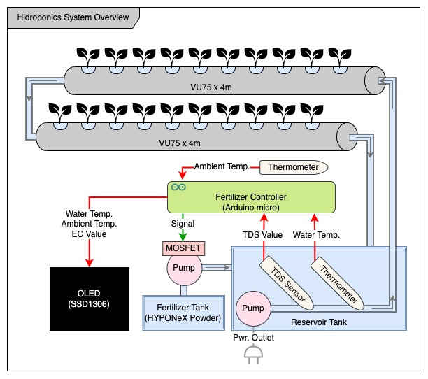

<h1> Hydroponics Auto-Fertilizing System </h1>

### System Overview
* The planter is built with VU75 plastic tube
* Ambient temperature, water temperature and TDS values are sensed periodically and displayed on OLED.
* Depending on the TDS value, fertilizer is pumped out to reservoir tank to keep EC value within desired range.

